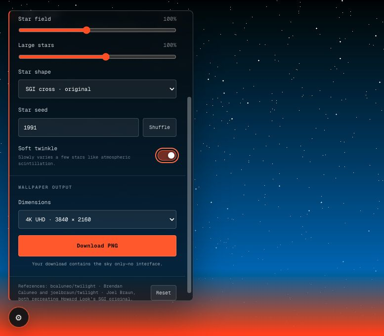
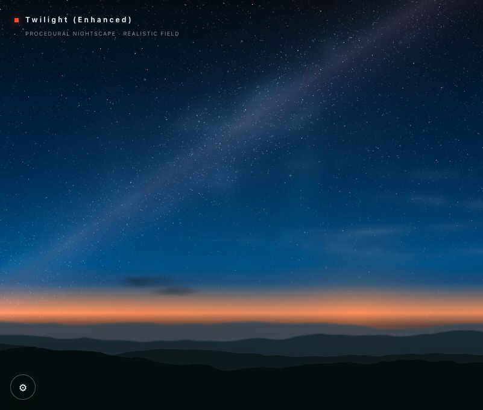
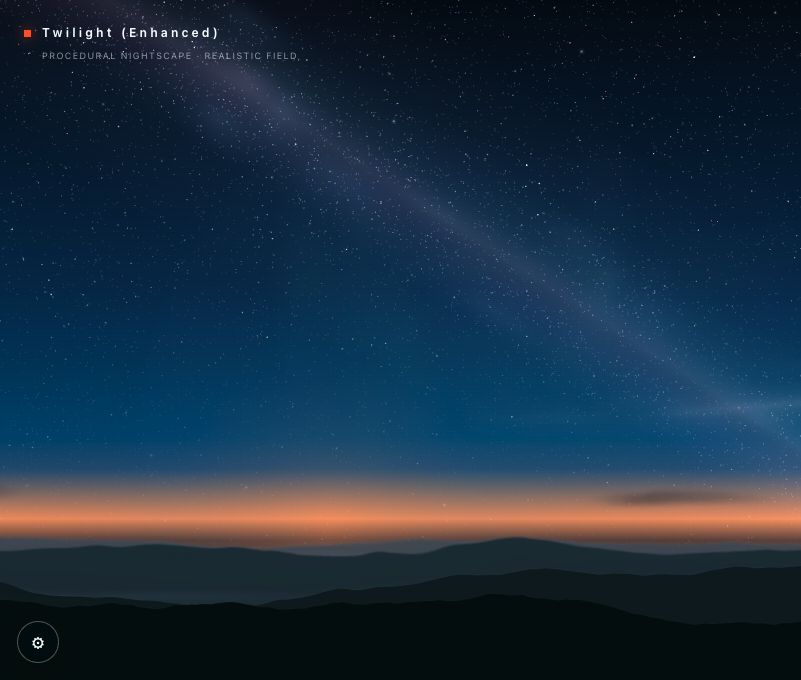
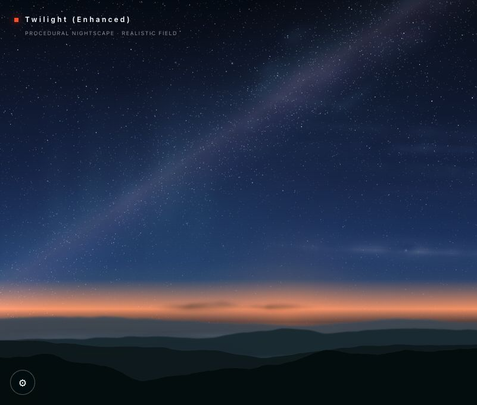

# Twilight Redux

Twilight Redux is a browser-based, generative wallpaper studio inspired by
Howard Look's classic 1991 Silicon Graphics IRIX `twilight` background. It
includes both a faithful SGI-inspired **Classic** sky and a photographic,
procedural **Enhanced** nightscape, with high-resolution PNG export for both.

Public Sites deployment:
[sgi-twilight-studio.dylanwoo757047.chatgpt.site](https://sgi-twilight-studio.dylanwoo757047.chatgpt.site)

> Dedicated to **Patty Ludwig** — avid skywatcher.

## Classic and Enhanced versions

### Twilight

Classic mode recreates the original orange-to-blue-to-black gradient,
deterministic point stars, SGI cross stars, and high-DPI diamond stars. Palette,
horizon, star counts, star shape, seed, and soft twinkle remain adjustable.

[](https://sgi-twilight-studio.dylanwoo757047.chatgpt.site)

### Twilight (Enhanced)

Enhanced mode extends the same controls into a living nightscape:

- A dense, naturally varied star field with a subtle procedural Milky Way.
- Restrained aurora, horizon-lit cirrus, and darker low clouds.
- Independently randomized clouds that drift left to right, overlap naturally,
  and support 100–200% density plus one-click reshuffling.
- Layered Appalachian-style ridgelines with adjustable distant softness and a
  crisp foreground silhouette.
- A 0–34% horizon glow that changes intensity, vertical position, and depth
  without moving the mountains.
- Random-angle satellites, planes, and fast comets every 25–115 seconds.
  Satellites favor the upper sky and use a subtle, low-glare treatment.
- Automatic soft twinkle when Enhanced mode is enabled.
- A 3-in-8 chance of opening directly in Enhanced mode; the title and settings
  switch can move between both versions at any time.

## Latest production captures

These scenes were captured from the published Enhanced renderer. Each reload
uses independently shuffled star, Milky Way, cloud, and mountain layouts.

[](https://sgi-twilight-studio.dylanwoo757047.chatgpt.site)

| Shuffled Milky Way and layered horizon | Cirrus and darker horizon clouds |
| --- | --- |
| [](https://sgi-twilight-studio.dylanwoo757047.chatgpt.site) | [](https://sgi-twilight-studio.dylanwoo757047.chatgpt.site) |

## Shared features

- Full-screen, responsive canvas preview.
- Authentic SGI palette plus two restrained alternatives.
- Deterministic star seeds and independently shuffled cloud layouts.
- Reduced-motion-aware animation and keyboard-accessible controls.
- Full HD, QHD, ultra-wide, 4K, 5K, and custom PNG export.
- Export files contain only the rendered wallpaper, never the interface.
- A translucent settings panel opened from the bottom-left gear.

## Reference implementations

This project is informed by two modern recreations of the original program:

- [bcaluneo/twilight](https://github.com/bcaluneo/twilight), maintained by
  Brendan Caluneo. This SDL/C++ implementation closely follows Howard Look's
  original gradient and star-color behavior.
- [joelbraun/twilight](https://github.com/joelbraun/twilight), maintained by
  Joel Braun. This standalone C generator adapts the wallpaper for 5K output,
  including high-DPI star scaling, capped reference counts, and a diamond-star
  option.

Howard Look wrote the original Silicon Graphics `twilight` program. The
original SGI source and its copyright and warranty notice are preserved in both
reference repositories. See [NOTICE.md](NOTICE.md) for this project's
attribution details.

## Run locally

Requirements:

- Node.js 22.13 or newer
- npm

Install dependencies and start the development site:

```bash
npm ci
npm run dev
```

Then open `http://localhost:3000`.

## Validate a production build

```bash
npm run build
node --test tests/rendered-html.test.mjs
```

## Key files

- `app/TwilightStudio.tsx` contains the canvas renderer, controls, and PNG
  export workflow.
- `app/globals.css` contains the responsive interface styling.
- `app/page.tsx` and `app/layout.tsx` provide the page and metadata.
- `tests/rendered-html.test.mjs` verifies the rendered product surface and
  attribution.
- `.openai/hosting.json` contains the Sites project binding.

## Technology

The site uses React 19, TypeScript, the Next-compatible vinext runtime, and the
browser's native 2D Canvas API. The renderer has no image-processing dependency:
the preview and downloaded wallpapers are produced by the same deterministic
code path.
